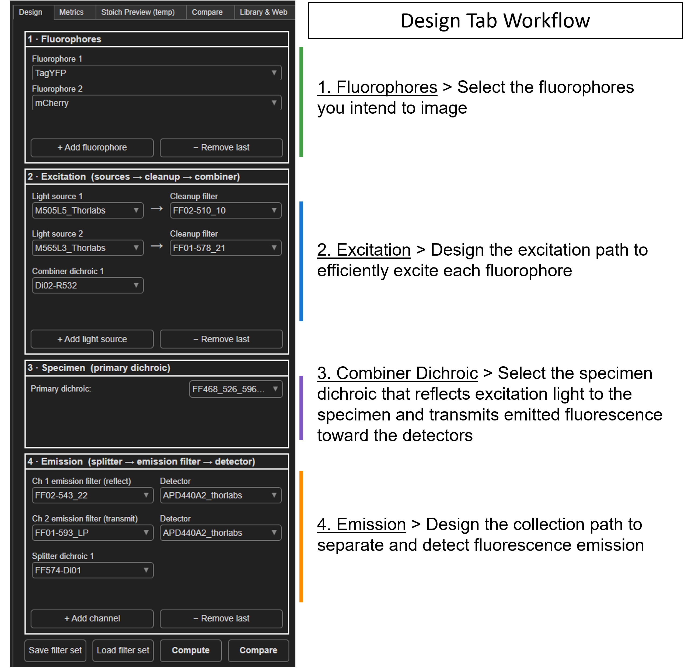
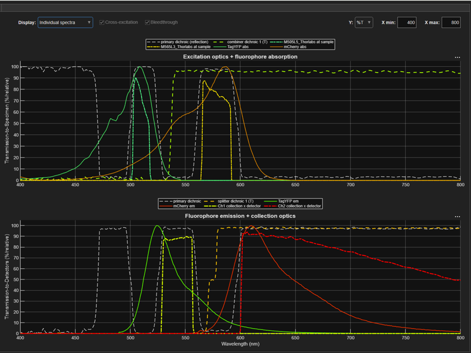
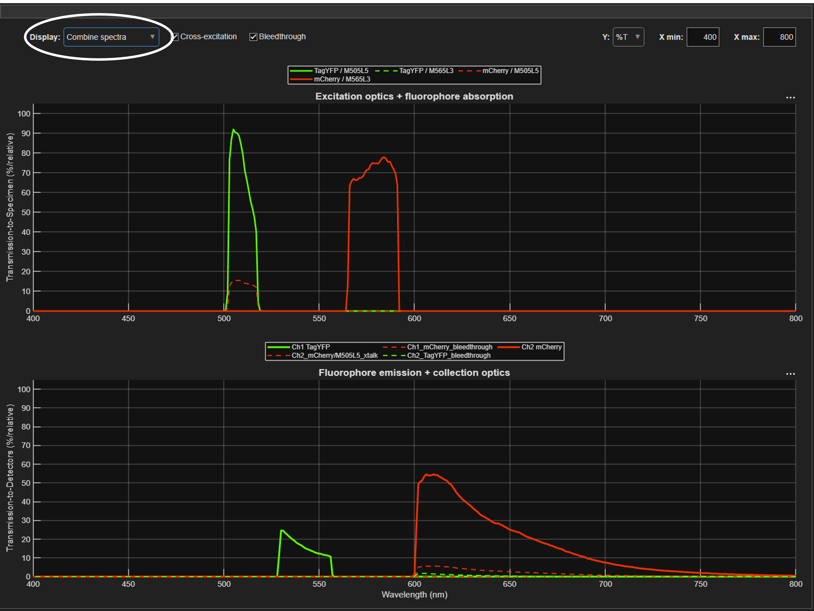

# 🔬 Fluorescence Filter-Set Designer

**Pick the right lasers, dichroics, emission filters and detectors for your
multi-colour fluorescence experiment — and *see* how much signal, crosstalk and
background each choice gives you, before you spend a cent.**

This is a MATLAB app built for biologists. You draw your microscope/photometry
light path with drop-down menus, and it instantly shows you the spectra and the
numbers that matter: how brightly each fluorophore is excited, how cleanly the
colours are separated, and what limits your signal-to-noise.

It knows the **Semrock, Chroma, Omega and Zeiss** filter catalogues and the
**FPbase** fluorescent-protein/dye database, so you can search and load real
parts over the internet instead of hunting for data sheets.

---

## App screenshots

**Design workflow**



**Individual spectra view**



**Combined spectra view**



---

## Why you might want this

- “Which emission filter best separates **mNeonGreen** from **mRuby3**?”
- “If I add a **561 nm** laser, how much does it also excite my green sensor (cross-excitation)?”
- “How much **GFP emission bleeds** into my red channel?”
- “Is my signal limited by **autofluorescence**, **laser back-reflection**, **read noise**, or just **photon shot noise**?”
- “What’s the **best filter set** I can build from the parts available?”

If you’ve ever sketched a filter cube on a whiteboard and guessed, this replaces
the guessing with spectra and numbers.

---

## Quick start

1. **Install MATLAB** (R2020b or newer; tested on R2026a). No extra toolboxes
   required for the core app.
2. **Download / clone this repository.**
3. In MATLAB, go to the project root folder and run:

   ```matlab
   runApp
   ```

4. The app opens on the **Design** tab with a working 1-colour example.
   Use the drop-downs to choose your fluorophores, light sources, dichroics,
   filters and detector — the plots update live.

That’s it. An internet connection is optional but lets you pull spectra from
FPbase and the filter vendors.

---

## The tabs, in plain language

### 1. Schematic — *your light path, as drop-downs*
Build your system box by box:

- **Fluorophores** – the dyes/proteins you’re imaging (add as many as you like).
- **Excitation** – your light sources (laser lines or lamps), an optional
  clean-up filter on each, and a combiner dichroic if you have more than one.
- **Specimen** – the primary (multi-band) dichroic, plus realistic
  *back-reflection* and *blocking* settings.
- **Emission** – one detection channel per colour: a splitter dichroic, an
  emission filter and a detector for each.

Two live plots show the **excitation side** (top) and the **emission side**
(bottom). Switch **Optics view** between:

- **Individual spectra** – every filter/dichroic/fluorophore curve overlaid
  (with %T or OD on the y-axis), and
- **Combined result** – the *net* result: how strongly each fluorophore is
  actually excited, and the detected fluorescence as a **% of the ideal**
  (perfect optics) so you can compare configurations at a glance.

Two summary tables sit next to the plots:

- **Cross-excitation %** – light source (rows) × fluorophore (columns): does a
  laser excite a fluorophore it shouldn’t?
- **Bleedthrough %** – fluorophore (rows) × channel (columns): does a
  fluorophore’s emission leak into the wrong detection channel?

**Save / Load filter set** stores a whole design so you can reopen or share it.

### 2. Physics metrics — *real numbers in photons and electrons*
Enter acquisition settings (excitation power, spot size, integration time,
numerical aperture, read noise, dye concentration) and get out the quantities
that decide image quality: detected photons, **signal-to-noise ratio**, and the
breakdown of noise into shot noise, read noise, dark current,
autofluorescence and laser back-reflection. Includes brain-tissue and
optical-fibre autofluorescence models for *in vivo* / fibre-photometry users.

### 3. Compare — *compare filter sets side by side*
Send any design into the Compare tab to keep a side-by-side table of the optics
you chose and the physics metrics they produce. This is useful when you are
trying several dichroic/filter combinations and want a clean record of the
tradeoffs.

### 4. Library & Web — *get real parts*
Search **FPbase** for fluorescent proteins and dyes, and the
**Semrock/Chroma/Omega/Zeiss** catalogues for filters and dichroics, then
download them straight into your library. A duplicate-finder keeps the library
tidy.

The old optimizer layout is archived as `filterSetApp/optimizerApp.m` in case
you want to bring that workflow back later.

---

## Companion app: signal-to-noise calculator

For a deeper, absolute noise analysis you can launch:

```matlab
FilterSetSNRApp
```

It loads a configuration saved from the Schematic and computes per-channel SNR
following the IDEX/Semrock *Spectral Modeling in Fluorescence Microscopy*
framework, extended with photon shot noise, detector read noise, dark current
and autofluorescence. It also has a **parameter sweep** (e.g. SNR vs integration
time or laser power) to find where you become read-noise- vs shot-noise-limited.

---

## Bringing in your own spectra

The app reads plain text/CSV spectra and auto-detects the format (tab or comma
separated, %T vs 0–1 scale, header or not). To add a filter, dichroic, light
source or fluorophore by hand, drop a file into the matching folder:

| Folder | What goes in it |
|--------|-----------------|
| `spectra/Proteins` | fluorophore excitation/emission spectra |
| `spectra/Filters` | bandpass / long-pass / short-pass emission & excitation filters |
| `spectra/Dichroics` | dichroic / beamsplitter transmission curves |
| `spectra/Illumations` | lamp / LED light-source spectra |
| `spectra/Detectors` | camera / PMT / APD quantum-efficiency curves |

**File format:** wavelength in the first column, then the spectrum value(s).
Two columns = a single transmission/QE curve; three columns
(`wavelength, excitation, emission`) = a fluorophore. Spectra are resampled onto
a common axis automatically, so 0.2 nm, 0.5 nm or 1 nm steps all work. Click
**Reload local** in the Library & Web tab after adding files.

---

## Requirements

- **MATLAB R2020b or newer** (developed and tested on R2026a).
- Internet connection **only** if you want to download spectra from FPbase or
  the filter vendors; everything else works offline.

---

## A note on accuracy

The spectral overlaps, crosstalk, bleedthrough and back-reflection are computed
directly from the real spectra you load, so they’re quantitative and comparable
between designs. The absolute photon/electron numbers in the Physics-metrics tab
depend on the acquisition parameters you enter and assume a lumped (point-style)
collection geometry — ideal for fibre photometry and single-detector setups, and
a good relative guide for camera imaging. Treat them as well-grounded estimates
for *comparing* configurations rather than as a calibrated photon budget.

---

## Acknowledgements

Spectral data courtesy of [FPbase](https://www.fpbase.org) and the filter
manufacturers’ published catalogues. Noise modelling follows the IDEX/Semrock
*Spectral Modeling in Fluorescence Microscopy* application note.

Happy imaging! 🧫
